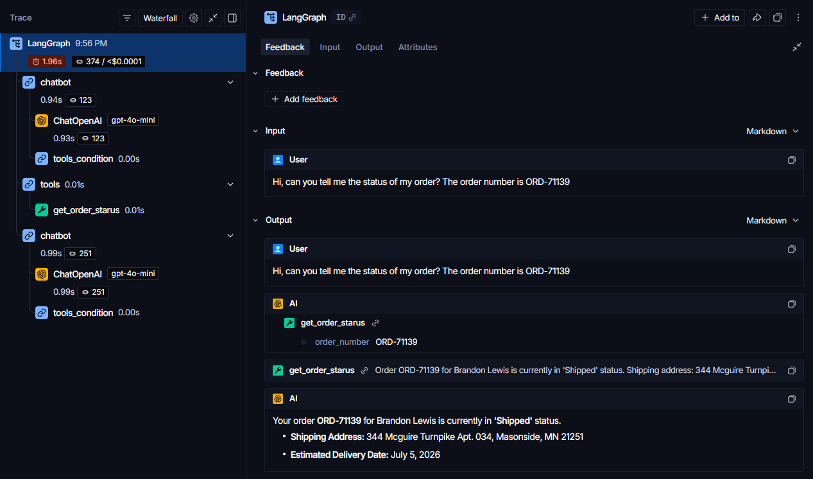

# 🤖 Order Tracking AI Agent

An enterprise-ready AI Agent designed to handle customer order inquiries. Built with **LangGraph** and **FastAPI**, this project demonstrates how to move beyond simple chat wrappers and create autonomous agents capable of Tool Calling and interacting with internal databases.

## 🚀 Key Features
- **Agentic Workflow:** Uses LangGraph to manage state and routing (deciding when to answer vs. when to query the database).
- **Tool Calling:** Custom Python tools connected to a mock SQLite database to retrieve real-time order status.
- **RESTful API:** Served via FastAPI for easy integration with frontend interfaces or customer support platforms.
- **Dockerized:** Fully containerized for seamless deployment.
- **Observability & Tracing:** Fully integrated with LangSmith to monitor LLM token usage, tool execution latency, and agent decision-making processes.

## 🛠️ Tech Stack
- **Frameworks:** FastAPI, LangGraph, LangChain
- **LLM:** OpenAI (gpt-4o-mini)
- **Database:** SQLite, SQLAlchemy
- **Environment:** Docker, Python 3.11

## ⚙️ How to Run Locally

### 1. Clone the repository
```bash
git clone [https://github.com/YOUR_USERNAME/order-tracking-agent.git](https://github.com/YOUR_USERNAME/order-tracking-agent.git)
cd order-tracking-agent
```

### 2. Set up environment variables
Create a `.env` file in the root directory:
```env
OPENAI_API_KEY=sk-your-openai-api-key
LANGSMITH_TRACING_V2=true
LANGSMITH_ENDPOINT=[https://api.smith.langchain.com](https://api.smith.langchain.com)
LANGSMITH_API_KEY=lsv2_pt_your_langsmith_api_key
LANGSMITH_PROJECT=Order-Tracking-Portfolio
```

### 3. Run with Docker (Recommended)
Make sure Docker is running on your machine, then execute:
```bash
docker-compose up --build
```
*The API interactive documentation will be available at: `http://localhost:8000/docs`*

### 4. Run without Docker (Virtual Environment)
```bash
python -m venv .venv
source .venv/bin/activate
pip install -r requirements.txt
python -m database.seed
uvicorn api.main:app --reload
```

## 🧪 Usage Example
You can test the agent using the Swagger UI at `http://localhost:8000/docs` or via cURL. Send a POST request to `/chat` with a valid order number:

**Request:**
```json
{
  "message": "Hi, what is the status of my order? The order number is ORD-71139"
}
```

## 📊 LangSmith Tracing
Below is an example of the agent's thought process and tool execution, traced via LangSmith:

